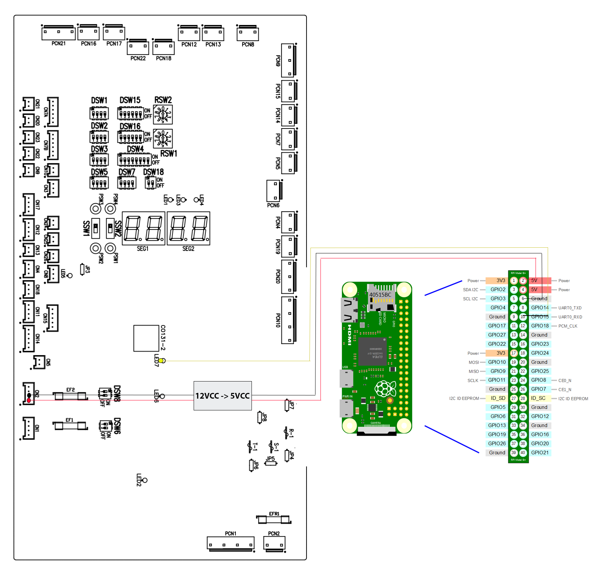
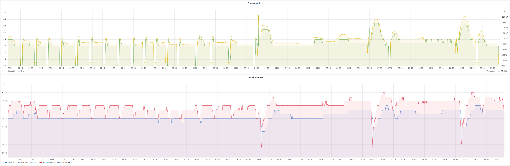
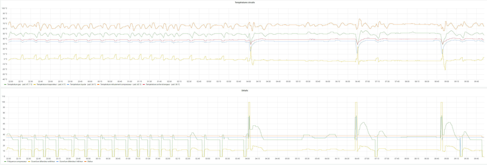

## Project meaning

This project is designed to read data from an Heat Pump **Hitachi Yutaki S80 Combi** through the H-LINK serial protocol.

The H-LINK protocol is used by the Heat pump to send data between the remote (in the house), the internal unit (in the basements) and the external unit (outside).

The HLINK protocol is a serial data bus at 9600 bauds/s. But in order to power the remote, this data bus has a 12VCC power in addition of the data bus.

There are two main ways to retieve data :
1. Build a sniffer to erathe the 12VCC compound and only get the data compound. See [https://github.com/LenShustek/M-NET-Sniffer](https://github.com/LenShustek/M-NET-Sniffer) and [https://github.com/Arnold-n/P1P2Serial](https://github.com/Arnold-n/P1P2Serial) for more informations.
2. Gets the 5V data compound directly from the led on the PCB which blinks when data are sent to the HLINK bus. This led is literally connected to the data bus. 

In this repo, we'll implement the second solution.

## Hardware

For this project I use a **Raspberry Pi Zero 2W**. You can also use an Arduino or ESP32 like.

The main purpose of the RPI is to have a build-in wifi chip. Once OS installed, configure the wifi, allow SSH connection and you can easily remote control your pi once hidden into the heatpump.

The wifi is used to send data to an MQTT broker into the local network.

The data wire (RX) is connected to the left pin of the HLINK led on the main PCB. 

The 5VCC gets using the 12VCC power line of the HLINK connector. You'll need a 12VCC to 5VCC converters to power the Pi. You need to get the power from this PCB because ground must be common in order to properly read the data coming from the serial protocol.



## Software

This project is based on a **python3** script.

### Requirements 
```
apt-get install python3 python-serial python3-serial screen
```

Using raspi-config util, disable the login shell access over the serial but keep the serial hardware enabled. Then reboot.

Check if your serial is enabled using `dmesg | grep tty`. You should see " [tty1] enabled" and "... ttyS0 at MMIO...". Which means the ttyS0 is ready to use.

Check this link if you need more details to enable serial on RPI : [https://pimylifeup.com/raspberry-pi-serial/](https://pimylifeup.com/raspberry-pi-serial/)

Install `requirements.txt` python dependencies.

### Usage

Start the python script in a screen terminal :
```
screen -d -m sudo python3 main.py
```

### How it works?

The **main.py** script is designed to continuously read bytes coming from the serial RX port.

Bytes are converted to integers and stored in a string as a data frame. 

The data frames begins with *"41 1"* sequence. There are a lot of unreadables data frames. But the one we need to parse and analyze contains *"41 1 1 1 0 -30"* sequence at the start and the *"33 0" *sequence at the end.

Once this sequence is retrieved, the script will send it as a JSON object to an MQTT server. A NodeRed server is designed to parse this object and store it in a database.

### Data frames meaning

The data frames between the start and the end sequence has been understood using reverse engineering. Some data may be incorrect or may be changed from a heatpump model to another one.

| Index in trame | Description | Unit |
| ----------- | ----------- | ----------- |
| 7 | Inside regulator opening | % |
| 8 | Outside regulator opening | % |
| 9 | Compressor frequency | Hz |
| 11 | Heatpump intensity input | A |
| 15 | Water IN temperature | °C |
| 16 | Water OUT temperature | °C |
| 21 | Exchanger output temperature | °C |
| 22 | Heating circuit : gaz temperature | °C |
| 23 | Heating circuit : liquid temperature | °C |
| 24 | External sensor temperature | °C |
| 26 | Compressor discharge temperature | °C |
| 27 | Evaporator temperature | °C |

## Final usage

Once data send through MQTT broker and read from the Node Red server, they are store in an InfluxDB database.

The, a Grafana server reads the database in order to build some charts.

Here are some examples :





## Acknowledgements

Many thanks to the following persons:
- **Aneantisor** wich originally wrote the french topic which helps me a lot [here](https://www.forumconstruire.com/construire/topic-409341-recuperation-donnees-link-2.php)
- **Jetblack** for its researches to find the repo of the M NET sniffer
